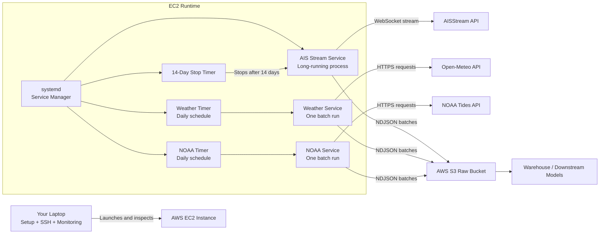
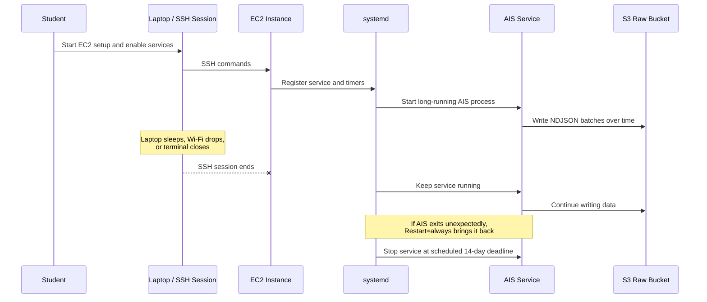
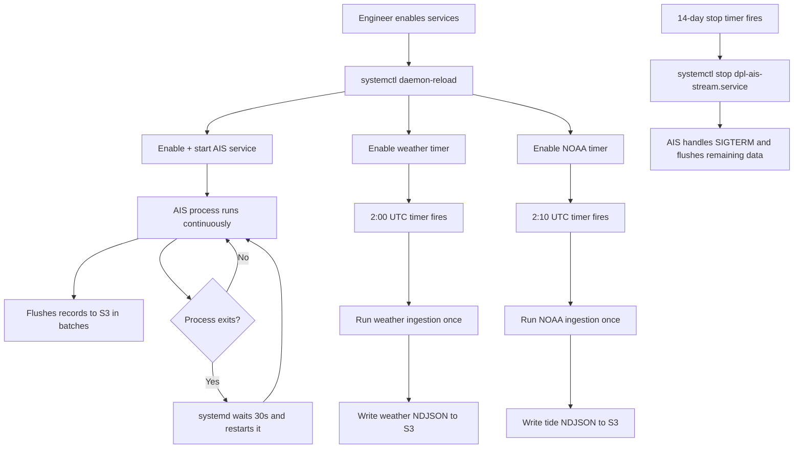

# EC2 Ingestion Implementation Explained

This document explains the changes made to support long-running ingestion on EC2 in a way that a new computer science student can follow and reuse later.

The goal is not just to show commands that work. The goal is to explain why the system is designed this way, what each block does, and how this matches real-world data engineering practice.

## What We Changed

We made three changes:

1. We added a new runbook at `docs/03-ec2-ingestion-runbook.md`.
2. We added a real command-line entrypoint to `ingestion/clients/weather.py`.
3. We added the new docs pages to `mkdocs.yml` so they show up in the project documentation site.

These changes matter because a good system is not only code that runs. A good system is also:

- operable by another engineer later
- resilient to disconnects and failures
- understandable by someone new to the project
- explicit about assumptions like Python version and AWS credentials

## The Big System Design Idea

The central idea is this:

- your laptop is no longer the machine responsible for staying awake for 14 days
- the EC2 instance becomes the machine responsible for running the ingestion process
- `systemd` becomes the process supervisor responsible for keeping that work alive

That is how production systems are usually built.

In industry, we try to avoid designs that depend on one engineer keeping one terminal open. That is fragile. A remote service manager is much stronger.

## High-Level Architecture Diagram

This diagram shows the system at a high level.



### How To Read This Diagram

- your laptop is only the control point for setup and inspection
- the EC2 instance is the machine actually doing the ingestion work
- `systemd` is the manager that starts, restarts, schedules, and stops jobs
- each ingestion client writes raw data to S3 as NDJSON
- downstream warehouse work happens after data lands in S3

The most important lesson here is that the data pipeline has both:

- a data plane, which is the movement of AIS, weather, and tide data into S3
- a control plane, which is the service manager deciding when processes run

Good production systems make both planes explicit.

## Failure-Resilience Diagram

This diagram shows why local machine problems no longer stop ingestion once the service is started on EC2.



### Why This Diagram Matters

Students often confuse:

- where they launch a process
- where the process actually lives

This design makes that distinction clear:

- you launch from your laptop
- the process lives on EC2
- `systemd` owns that process after launch

## Change 1: Adding A Real CLI Entrypoint For Weather

File:

- `ingestion/clients/weather.py`

We added this block:

```python
def main() -> None:
    """Run weather ingestion once and exit."""
    settings = Settings()
    settings.validate()
    logger.info(
        "weather_ingestion_starting",
        ports=len(load_port_coordinates()),
    )
    client = WeatherIngestionClient(settings)
    key = client.run()
    logger.info("weather_ingestion_done", s3_key=key)


if __name__ == "__main__":
    main()
```

### Why We Needed This

Before this change, the weather module contained the logic to fetch data and write it to S3, but it did not contain a standard Python entrypoint.

That meant a command like this:

```bash
uv run python -m ingestion.clients.weather
```

would not reliably perform the ingestion job in the way our runbook expected.

In production, this is a common requirement:

- code should not only exist as importable classes
- it should also expose clear executable entrypoints for automation tools

Schedulers, service managers, cron jobs, containers, and orchestration systems all work better when each task has a clean start command.

### Line-By-Line Explanation

#### `def main() -> None:`

This defines the top-level function for the script.

Why this is good practice:

- it keeps executable logic in one clear place
- it avoids side effects at import time
- it makes testing and reuse easier

In industry, we often separate:

- library code: reusable classes and functions
- application code: the actual command that runs the job

#### `settings = Settings()`

This creates a configuration object from environment variables.

Why it matters:

- we do not hard-code secrets in the Python file
- the same code can run in dev, staging, or production with different environment values

This is a standard production pattern called environment-based configuration.

#### `settings.validate()`

This checks that required configuration exists before the job starts.

Why it matters:

- it fails fast
- it gives a clear error earlier
- it avoids wasting time doing partial work before discovering a missing bucket or secret

This is another real-world best practice. Fail early, fail loudly, and fail with a useful message.

#### `logger.info(... ports=len(load_port_coordinates()))`

This writes a structured startup log telling us how many ports the job is about to process.

Why logging matters:

- operators need visibility into what the system is doing
- logs become the first debugging tool when a scheduled job fails
- startup logs help confirm the job loaded the expected data

In data engineering, logs are part of the product, not an afterthought.

#### `client = WeatherIngestionClient(settings)`

This constructs the object that knows how to run the weather ingestion workflow.

Why this design is helpful:

- `main()` handles startup and shutdown concerns
- `WeatherIngestionClient` handles business logic

That separation keeps responsibilities clean.

#### `key = client.run()`

This executes the actual ingestion and returns the S3 object key that was written.

Why that return value is useful:

- it gives us a concrete artifact of success
- it can be logged
- later, a scheduler or monitor could capture it

In production jobs, it is helpful when a successful run leaves behind both data and traceable metadata.

#### `logger.info("weather_ingestion_done", s3_key=key)`

This records a completion log that includes the S3 path of the data written.

Why this matters operationally:

- if the job ran at 2:00 AM, the engineer reviewing logs later can see exactly what file was created
- if no output appears downstream, we can confirm whether the write happened

#### `if __name__ == "__main__":`

This is the standard Python pattern for saying:

- if this file is run as a program, execute `main()`
- if this file is imported by another module, do not automatically run it

This is one of the most important Python habits for new engineers to learn.

It makes the file safe in two roles:

- reusable module
- executable script

## Change 2: Creating The EC2 Runbook

File:

- `docs/03-ec2-ingestion-runbook.md`

This file is the operational artifact. It explains how to run the ingestion system on EC2 in a way that survives local laptop problems.

This is important because real systems need runbooks.

A runbook is not just documentation. It is a repeatable operating procedure.

In industry, runbooks reduce risk because they:

- lower the chance of human error
- help new teammates operate the system safely
- make production behavior less dependent on tribal knowledge

## Why We Chose `systemd` Instead Of `tmux`

The original idea used `tmux` plus a long-running shell command. That can work for quick experiments, but it is not the strongest production pattern.

We chose `systemd` because it gives us:

- service management
- restart behavior
- boot-time enablement
- centralized logs
- timed execution

This is closer to how real Linux servers are operated.

### Student Mental Model

Think of the layers like this:

- Python code does the data ingestion work
- `uv` runs the Python environment consistently
- `systemd` is the supervisor that decides when and how the Python process runs
- EC2 is the host machine where all of that lives

Each layer has a different job. Good systems are built from clear layers with clear responsibilities.

## Service Lifecycle Diagram

This diagram zooms in on the control logic inside the EC2 instance.



### What This Lifecycle Shows

- continuous jobs and scheduled batch jobs can live in the same system
- the AIS stream is supervised like a service
- weather and NOAA are scheduled like batch tasks
- stopping the job is also managed by the operating system, not by your laptop shell

## Explaining The Runbook Blocks

### Block A: Provision The EC2 Instance

Example command:

```bash
cd /Users/loicns/Projects/data-party-logistics
bash infra/provision_server.sh
```

What this means:

- move into the repository
- run the provisioning script already present in the repo

Why this is good:

- setup becomes repeatable
- fewer manual AWS Console clicks
- infrastructure steps become documented and automatable

This is part of the infrastructure-as-code mindset, even when the script is shell-based instead of Terraform-based.

### Block B: Bootstrap The Runtime

Example block:

```bash
sudo apt update
sudo apt install -y curl git ca-certificates

curl -LsSf https://astral.sh/uv/install.sh | sh
source "$HOME/.local/bin/env"

git clone https://github.com/<your-username>/data-party-logistics.git
cd /home/ubuntu/data-party-logistics

uv python install 3.14
uv sync --python 3.14
cp .env.example .env
```

Why every part exists:

#### `sudo apt update`

Refreshes the package index on Ubuntu so the system knows what packages are available.

#### `sudo apt install -y curl git ca-certificates`

Installs tools needed to:

- download things securely
- clone the repository
- validate HTTPS certificates

#### `curl ... | sh`

Installs `uv`, which is the Python package and environment manager used here.

Why use `uv`:

- fast dependency installation
- consistent virtual environment management
- easy Python version handling

This is a modern developer tooling choice.

#### `source "$HOME/.local/bin/env"`

Loads the shell environment so the current terminal can find the newly installed `uv` command.

#### `git clone ...`

Copies the code onto the EC2 instance. Your EC2 machine needs its own copy of the repository because that is where the job will run.

#### `uv python install 3.14`

This matters because the repo currently declares:

```toml
requires-python = ">=3.14"
```

That means the codebase expects Python 3.14 or newer.

Why we called this out in the runbook:

- the default Ubuntu `python3` may not satisfy the repo requirement
- hidden version mismatches are a classic source of deployment bugs

Industry lesson:

- always align infrastructure setup with the version requirements declared in source control

#### `uv sync --python 3.14`

This installs the project dependencies into an environment managed by `uv`.

Why this is better than ad hoc installs:

- reproducibility
- fewer “works on my machine” problems
- closer alignment with the lockfile and project metadata

#### `cp .env.example .env`

Creates the real environment file from the example template.

Why this is common:

- the template documents needed variables
- the real `.env` stays machine-specific and secret-aware

## Block C: AWS Credentials On EC2

The runbook explicitly says the EC2 host itself must have AWS credentials.

This is a key systems concept for students:

- your laptop having AWS access is not enough
- the remote machine that runs `boto3` must also have AWS access

### Why IAM Roles Are Best Practice

Best practice in industry is to attach an IAM instance role to EC2.

Why:

- no long-lived AWS secrets need to be copied onto the machine
- credentials rotate automatically
- permissions can be narrowed to exactly what the service needs

This is more secure than placing personal credentials on a server.

### Why We Mentioned `AWS_PROFILE`

The repo’s config defaults `AWS_PROFILE` to `dpl`.

That is fine only if the EC2 box actually has a `dpl` profile configured.

If the machine is using an IAM role instead, keeping `AWS_PROFILE=dpl` in `.env` can point the SDK toward a profile that does not exist.

That is why the runbook says to remove `AWS_PROFILE` when using an instance role.

This is a subtle but very realistic deployment detail.

## Block D: The `systemd` AIS Service

We included this unit:

```ini
[Unit]
Description=Data Party Logistics AIS stream ingestion
After=network-online.target
Wants=network-online.target

[Service]
Type=simple
User=ubuntu
WorkingDirectory=/home/ubuntu/data-party-logistics
EnvironmentFile=/home/ubuntu/data-party-logistics/.env
Environment=PYTHONUNBUFFERED=1
ExecStart=/home/ubuntu/.local/bin/uv run python -m ingestion.clients.ais_stream
Restart=always
RestartSec=30
KillSignal=SIGTERM
TimeoutStopSec=120

[Install]
WantedBy=multi-user.target
```

This is one of the most important blocks in the whole implementation.

### `[Unit]`

This section describes service dependencies and startup conditions.

#### `Description=...`

Human-readable label for the service.

This helps when running commands like:

```bash
systemctl status dpl-ais-stream.service
```

#### `After=network-online.target`

Tells `systemd` to start this service only after the system believes networking is available.

Why that matters:

- AIS streaming depends on network access
- starting too early could fail for avoidable reasons

#### `Wants=network-online.target`

Says this service wants the network-online target to be brought up.

This is a softer dependency than `Requires`, but it is commonly used in service startup ordering.

### `[Service]`

This section defines how the process actually runs.

#### `Type=simple`

Tells `systemd` the process starts and stays in the foreground.

That is exactly what we want for a long-running Python worker.

#### `User=ubuntu`

Runs the service as the `ubuntu` user instead of root.

Why this is good:

- principle of least privilege
- fewer security risks
- safer file ownership behavior

Running application code as non-root is standard industry practice.

#### `WorkingDirectory=/home/ubuntu/data-party-logistics`

Sets the directory where the command runs.

Why this matters:

- relative paths inside the code behave as expected
- logs and file references are easier to reason about

#### `EnvironmentFile=/home/ubuntu/data-party-logistics/.env`

Loads environment variables from the project `.env` file.

Why this matters:

- secrets and configuration are separated from code
- the same service file can work across environments

#### `Environment=PYTHONUNBUFFERED=1`

Forces Python output to flush immediately.

Why this matters:

- logs appear right away in `journalctl`
- debugging live services becomes easier

#### `ExecStart=/home/ubuntu/.local/bin/uv run python -m ingestion.clients.ais_stream`

This is the actual command the service executes.

Breakdown:

- `/home/ubuntu/.local/bin/uv` is the runner
- `run` tells `uv` to execute in the project environment
- `python -m ingestion.clients.ais_stream` runs the AIS module as a program

Why the `-m` form is good:

- it uses the package/module structure correctly
- imports are more reliable than running a random file path directly

#### `Restart=always`

If the process exits, `systemd` will try to start it again.

Why this is important:

- long-running streams will eventually hit transient errors
- automatic recovery is a core production pattern

#### `RestartSec=30`

Waits 30 seconds before restarting.

Why not restart immediately:

- avoids hot restart loops
- gives the network or remote service a moment to recover

#### `KillSignal=SIGTERM`

When stopping the service, `systemd` sends `SIGTERM`.

This is excellent here because `ingestion.clients.ais_stream` already contains signal handling for graceful shutdown.

That means:

- the app can notice the shutdown
- flush remaining buffered records
- exit cleanly

This is a strong example of application code and operating system behavior being designed to work together.

#### `TimeoutStopSec=120`

Gives the process up to 120 seconds to stop cleanly before being forced.

Why this matters:

- the service may need time to flush buffered data to S3
- immediate hard kills are risky for data integrity

### `[Install]`

#### `WantedBy=multi-user.target`

This makes the service part of the normal server runtime when enabled.

In simpler words:

- if you run `systemctl enable`, the service can start on boot

That matters for resilience after reboots.

## Block E: The Weather And NOAA `oneshot` Services

These service files are similar, but they use:

```ini
Type=oneshot
```

Why:

- weather and NOAA ingestion are not endless streams
- they run once, produce a batch, and exit

This distinction is important:

- AIS is a daemon-like long-running service
- weather and tides are scheduled batch jobs

Recognizing the difference between streaming and batch workloads is a core data engineering skill.

## Block F: The `systemd` Timers

Example:

```ini
[Timer]
OnCalendar=*-*-* 02:00:00 UTC
Persistent=true
Unit=dpl-weather.service
```

### `OnCalendar=...`

This is the schedule.

It means:

- run this every day at 02:00 UTC

### `Persistent=true`

This is one of the best details in the design.

It means if the machine was off when the scheduled time passed, the missed run is triggered when the machine comes back.

Why this is great in practice:

- it reduces silent data gaps
- it is often better than a basic cron schedule for important jobs

This is the kind of detail production engineers care about.

### `Unit=dpl-weather.service`

Tells the timer which service it should trigger.

This is another nice systems design principle:

- the timer decides when
- the service defines what

Separating time from task keeps the design cleaner.

## Block G: Scheduling The 14-Day Stop On The Server

We used:

```bash
STOP_AT="$(date -u -d '+14 days' '+%Y-%m-%d %H:%M:%S UTC')"
echo "$STOP_AT"

sudo systemd-run \
  --unit dpl-stop-ais \
  --on-calendar "$STOP_AT" \
  /bin/systemctl stop dpl-ais-stream.service
```

This is an especially important design choice.

### Why This Is Smarter Than `timeout 14d ...`

`timeout 14d python ...` only protects the process inside the shell that launched it.

That works, but it is weaker because the control logic is tied to a specific shell session and process invocation style.

By contrast, `systemd-run --on-calendar` says:

- create a scheduled job on the EC2 machine itself
- at the future time, stop the named service

Why that is stronger:

- the schedule lives on the remote machine
- it does not depend on your laptop
- it works naturally with the service manager that owns the process

This is more like how real platform teams think.

## Block H: Verification Commands

Examples:

```bash
sudo systemctl status dpl-ais-stream.service --no-pager
sudo journalctl -u dpl-ais-stream.service -f
systemctl list-timers --all | grep dpl
```

These are observability commands.

A good engineer does not just start a service and hope. They verify:

- is it enabled
- is it running
- what do the logs say
- are the timers scheduled

This is a real production habit that students should practice early.

## Block I: Why The Runbook Does Not Schedule `s3_to_postgres`

In the original draft, there was a daily loader command for `ingestion/loaders/s3_to_postgres.py`.

But when we checked the repo, there was no committed source file at that path.

Why we removed it from the artifact:

- documentation should match reality
- a runbook must only instruct operators to run code that truly exists

This is a very important engineering lesson:

- never “paper over” a missing system component in docs
- if something is not in source control, call it out clearly

Trustworthy documentation is part of trustworthy systems.

## Change 3: Updating MkDocs Navigation

File:

- `mkdocs.yml`

We added the docs pages to the navigation so they appear in the generated documentation site.

That means the operational knowledge is not hidden in a random file. It becomes part of the project’s documented architecture.

Why this matters in industry:

- discoverability matters
- onboarding matters
- important docs should be easy to find

If a runbook exists but no one can find it, the operational risk is still high.

## Best Practices This Implementation Demonstrates

Here are the real-world practices behind the changes:

### 1. Separate Execution From Logic

The weather client now has:

- reusable code in classes
- executable code in `main()`

This makes automation easier and the codebase cleaner.

### 2. Prefer Service Managers Over Long-Lived Shell Sessions

For unattended jobs, `systemd` is stronger than keeping a terminal session alive.

### 3. Fail Fast On Missing Configuration

`settings.validate()` is a simple example of defensive engineering.

### 4. Use Structured Logging

Logs at start and finish make the system easier to operate.

### 5. Keep Docs Honest

We removed the missing loader from the operational flow instead of pretending it existed.

### 6. Match Runtime Setup To Declared Dependencies

Because the repo declares Python `>=3.14`, the server bootstrap must respect that.

### 7. Prefer IAM Roles Over Static Credentials

This reduces secret sprawl and improves security.

### 8. Design For Recovery, Not Just Success

`Restart=always`, graceful SIGTERM handling, and persistent timers all help the system recover from common failures.

## What This Means To The Overall System

Before these changes, the system was closer to:

- “an engineer can run this manually if they stay connected”

After these changes, the system is closer to:

- “the server can run this as a managed service with clearer operations”

That is a real maturity step.

It moves the project from a personal-machine workflow toward a production-minded workflow.

## If You Wanted To Extend This Later

A student who understands this design could later implement:

- an IAM role via Terraform instead of manual credential setup
- checked-in `systemd` unit files under `infra/systemd/`
- a real S3-to-Postgres loader service and timer
- monitoring alerts for repeated service failures
- CloudWatch log shipping
- a supervisor alternative such as Docker plus ECS for even more production maturity

That progression is realistic. Many real systems evolve exactly this way:

1. script
2. documented runbook
3. managed Linux service
4. infrastructure as code
5. container orchestration

## Final Student Takeaway

The most important lesson is that production engineering is not just writing business logic.

It is also about:

- how the code starts
- where configuration lives
- how failures are handled
- how logs are inspected
- how another person can operate the system safely

That is what we implemented here.

We did not just make the code run. We made the system more runnable, more explainable, and more aligned with real operational practice.
