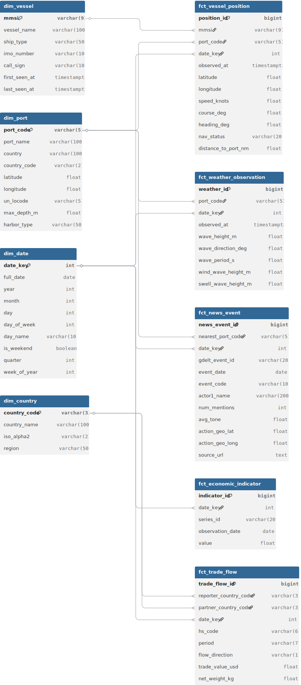

# Warehouse Schema

Kimball-style star schema for the Data Party Logistics data warehouse.

## Entity-Relationship Diagram

## Fact tables

| Table | Grain | Source | Approx. volume |
|---|---|---|---|
| fct_vessel_position | 1 row per AIS ping per vessel | AISStream WebSocket | ~100k-1M rows/day |
| fct_trade_flow | 1 row per country/commodity/period/flow | UN Comtrade | ~500 rows/month |
| fct_weather_observation | 1 row per port per hour | Open-Meteo | ~240 rows/day |
| fct_news_event | 1 row per filtered shipping news event | GDELT | ~100-500 rows/day |
| fct_economic_indicator | 1 row per series per observation date | FRED | ~3-90 rows/run |

## Dimension tables

| Table | Grain | Source | Size |
|---|---|---|---|
| dim_port | 1 row per port | WPI seed data | ~10 target ports (expandable) |
| dim_vessel | 1 row per MMSI | Derived from AIS | Grows with new vessels |
| dim_date | 1 row per calendar date | Generated | ~3,650 rows (10 years) |
| dim_country | 1 row per country | Comtrade + WPI | ~250 rows |

## Key joins for feature engineering (Week 5)

These are the JOIN patterns that produce ML training features:

- **Vessel ETA features:**
  `fct_vessel_position JOIN dim_vessel JOIN dim_port`
  → vessel speed, distance to port, vessel type, port depth

- **Port congestion features:**
  `fct_vessel_position GROUP BY port_code, date_key`
  → vessels_at_anchor, vessels_in_approach, queue_length_change

- **Weather impact features:**
  `fct_vessel_position JOIN fct_weather_observation ON (port_code, date_key)`
  → wave_height_at_destination, weather_severity_score

- **News disruption features:**
  `fct_news_event JOIN dim_port ON nearest_port_code`
  → gdelt_disruption_score (weighted avg_tone × num_mentions in last 48h)

- **Macro context features:**
  `fct_economic_indicator WHERE series_id = 'GSCPI'`
  → gscpi_latest (most recent value), gscpi_3mo_change (trend)

## Design decisions

| Decision | Choice | Rationale |
|---|---|---|
| Schema type | Kimball star | Optimized for queries, easy joins, well-understood by data teams |
| SCD type | Type 1 (overwrite) | Port metadata changes rarely; history not needed |
| Date dimension | Integer key (YYYYMMDD) | Fast filtering; pre-computed time attributes |
| PostGIS | Enabled | Required for nearest-port spatial joins and distance calculations |
| Surrogate keys | bigint GENERATED | Stable PKs; natural keys can change upstream |
