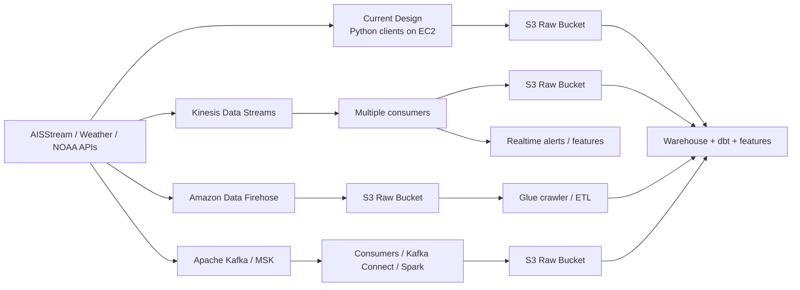
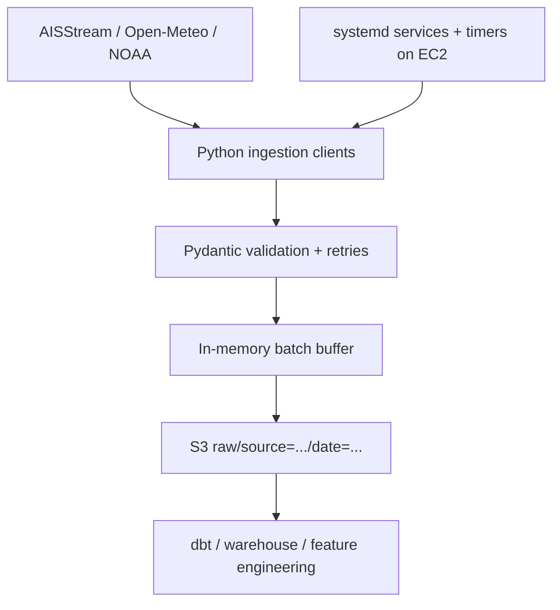
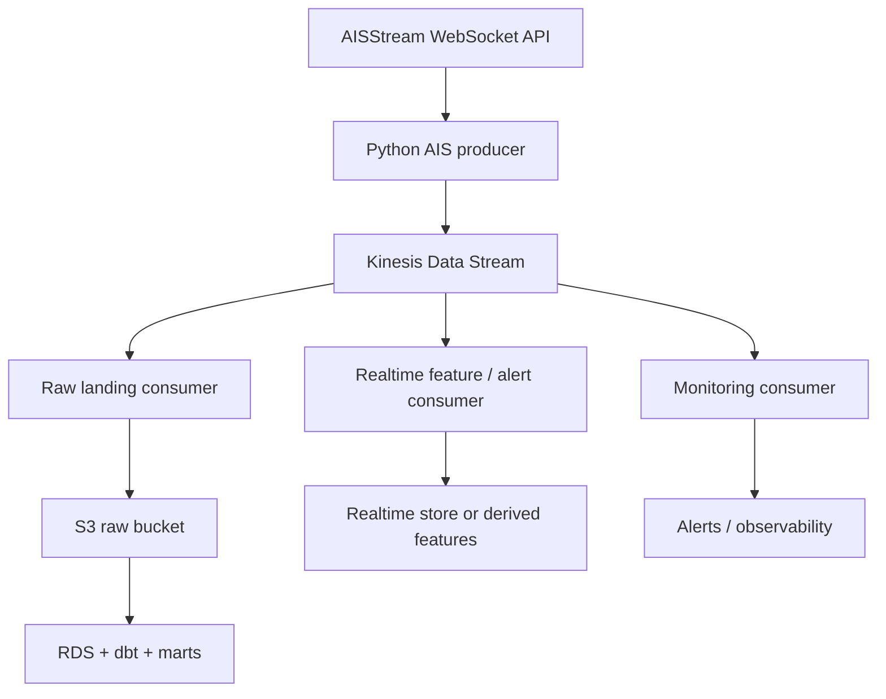
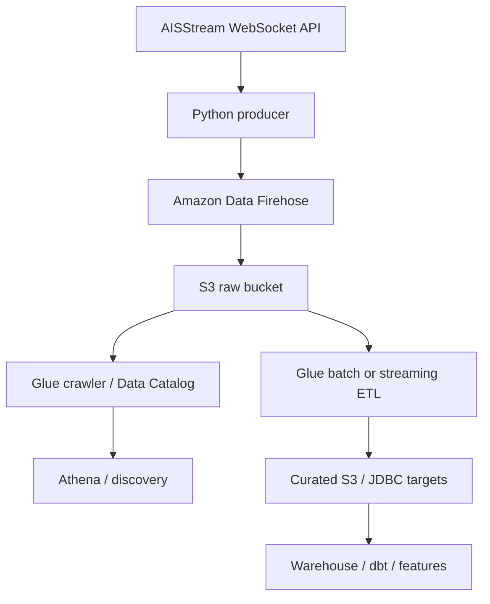
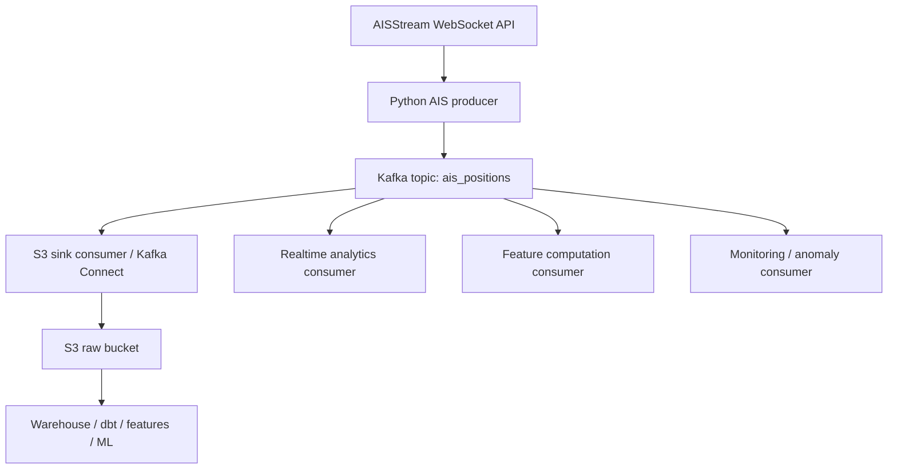
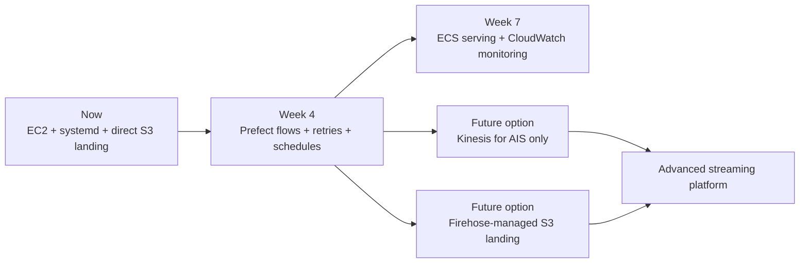

# Ingestion Architecture Options

This artifact compares four ways to run the ingestion layer for Data Party Logistics:

1. the approach currently implemented in this repo
2. Amazon Kinesis Data Streams
3. Amazon Data Firehose plus AWS Glue
4. Apache Kafka

It also answers three practical questions:

- how each option works
- how you would implement it in this system
- which option is the best fit for this project and how that compares with the later study guides

## Executive Summary

For this project, the best near-term choice is:

- keep the current EC2 + Python worker + S3 landing zone design for now
- add Prefect orchestration in the later weeks, because that is what the course path is designed around
- consider Kinesis Data Streams later only if you need multiple real-time consumers, replay, or sub-second fan-out from the AIS stream

I do not recommend moving this project to Apache Kafka right now.

Why:

- Kafka solves a bigger systems problem than this portfolio project currently has
- it adds meaningful operational complexity
- the later study guides are built around Python clients, S3, dbt, Prefect, and ECS, not Kafka-first streaming infrastructure

## The Four Options At A Glance

| Option | Core idea | Biggest strength | Biggest weakness | Best fit here |
|---|---|---|---|---|
| Current repo design | Python clients write raw NDJSON directly to S3 from EC2 | simplest path, cheapest mental model, easy to explain | no shared stream buffer between producer and consumers | excellent now |
| Kinesis Data Streams | producer writes events to a managed stream with retention and multiple consumers | replay, parallel consumers, low latency | more moving parts and more AWS-specific design | strong future upgrade for AIS only |
| Data Firehose + Glue | producer sends records to Firehose, Firehose buffers and lands to S3, Glue catalogs/transforms later | easy S3 delivery, low ops overhead | less control, higher buffering latency, not a full event bus | good if you mainly want S3 landing with minimal stream logic |
| Apache Kafka | producer writes to topics/partitions, many consumers read independently | most flexible ecosystem, strong multi-consumer streaming platform | highest operational complexity | overkill for this project now |

## High-Level Comparison Diagram

## Option 1: The Current Design In This Repo

## How It Works

The current design is:

- a Python AIS client opens a WebSocket connection to AISStream
- the client validates messages with Pydantic
- it batches records in memory
- it writes NDJSON files directly to S3
- EC2 plus `systemd` keep the process alive for 14 days
- daily batch-style clients like weather and NOAA run as scheduled jobs and also write to S3

In short, this is a direct producer-to-S3 landing pattern.

## Current Architecture Diagram

## Pros

- simplest system to understand and operate
- very aligned with the Week 2 and Week 4 course design
- easy to debug because the ingestion code is plain Python
- low infrastructure overhead
- easy to explain in interviews as a clean landing-zone architecture
- raw S3 files are immediately available for downstream dbt and ML work

## Cons

- there is no stream buffer between the external API and your downstream consumers
- replay is limited to whatever you already landed in S3
- if later you want multiple independent real-time consumers, you need to build more yourself
- scaling many concurrent consumers is less natural than with a dedicated streaming platform

## How To Implement It In This System

This is mostly what already exists:

- keep `ingestion/clients/ais_stream.py` as the producer/validator
- keep `ingestion/s3_writer.py` as the raw landing writer
- run AIS continuously via `systemd` on EC2
- run weather and NOAA with timers now, then Prefect later
- keep S3 as the central raw landing zone

## Best Use In This Project

This is the best fit when:

- you mainly need one reliable raw landing path into S3
- you want to learn ingestion patterns, warehousing, orchestration, and ML system design
- you do not yet need a dedicated multi-subscriber event backbone

## Option 2: Amazon Kinesis Data Streams

## How It Works

Kinesis Data Streams is a managed stream made of shards. Producers put records into the stream, and consumers read from it. Records are retained for a configured retention period, and multiple consumers can process the same stream independently.

Important concepts:

- stream: the overall event stream
- shard: a unit of throughput and parallelism
- partition key: decides which shard a record goes to
- retention: how long the records stay available for replay
- consumer: an application that reads records from the stream

For your project, Kinesis would be most relevant for AIS, not for the slower daily APIs.

## Kinesis Architecture In Your Project

## Pros

- very good for low-latency streaming
- strong fit when you want multiple independent consumers from one stream
- replay is much cleaner than direct-to-S3 ingestion because records stay in the stream for retention
- integrates well with AWS services and Glue streaming ETL
- good middle ground between simplicity and real streaming capability

## Cons

- you still need a custom producer because AISStream is an external WebSocket source
- you need to reason about shards, throughput, partition keys, and consumer behavior
- more AWS lock-in than the current design
- more expensive and more architecturally complex than just writing to S3

## How It Would Work In This System

You would change the AIS path like this:

1. keep the external AIS WebSocket client in Python
2. instead of writing batches directly to S3 first, publish each validated record or micro-batch into Kinesis
3. create one consumer that reads from Kinesis and writes raw NDJSON or Parquet to S3
4. optionally add another consumer for live alerts, vessel-state aggregation, or near-real-time feature updates
5. keep weather and NOAA as batch jobs to S3; they do not need Kinesis

## Example Implementation Sketch

- producer:
  - `ingestion/clients/ais_stream.py` becomes a Kinesis producer using `boto3.put_records`
- raw landing consumer:
  - new worker reads from Kinesis and writes `raw/source=ais/...` to S3
- orchestration:
  - EC2 or ECS runs the producer and consumers
- downstream:
  - dbt, warehouse, and feature engineering stay mostly unchanged because S3 remains the landing zone

## When Kinesis Is Worth It Here

Kinesis becomes attractive if you later need:

- replayable AIS event history before landing
- several consumers reading the same live stream
- realtime downstream actions beyond just raw storage
- lower-latency streaming fan-out than a file-only workflow

## Option 3: Amazon Data Firehose Plus AWS Glue

## How It Works

Amazon Data Firehose was previously named Amazon Kinesis Data Firehose. If you see both names in tutorials, they refer to the same managed delivery service.

Amazon Data Firehose is a fully managed delivery service. You send records to Firehose, and it buffers them and delivers them to destinations like S3. You can optionally transform records during delivery, and then use Glue to catalog or transform the landed data after it arrives.

For your project, this usually means:

- your Python client still receives the external AIS WebSocket data
- your client sends records to Firehose instead of writing files itself
- Firehose writes the data into S3
- Glue crawler or Glue jobs help catalog or transform the landed data

## Firehose And Glue Architecture In Your Project

## Pros

- very low operational overhead for landing records into S3
- buffering, batching, retries, and delivery are managed for you
- easy fit if your primary destination is S3
- Glue can help with cataloging and later ETL workflows
- cleaner than running your own “writer” service if all you want is managed delivery

## Cons

- Firehose is not a general-purpose stream processing backbone like Kinesis Data Streams or Kafka
- buffering improves efficiency but increases freshness delay
- you still need a custom upstream producer because Firehose does not open the AIS WebSocket for you
- less flexible if you want multiple real-time consumers working independently off the same event stream
- Glue is helpful downstream, but it does not replace the need for your ingestion producer

## How It Would Work In This System

For AIS:

1. keep the Python WebSocket client
2. after validation, send records to Firehose with `PutRecordBatch`
3. let Firehose write to the S3 raw prefix
4. optionally use Firehose transformations for small record reshaping
5. use Glue crawler to register S3 partitions or Glue ETL for later transformations

For weather and NOAA:

- you could send them to Firehose too, but the benefit is smaller because they are already batch-like and easy to write directly to S3

## Best Use In This Project

Firehose is a good choice if your main goal is:

- “I want managed delivery into S3 with minimal stream operations”

It is weaker if your main goal is:

- “I want a reusable streaming backbone with multiple consumers and replay semantics”

## Option 4: Apache Kafka

## How It Works

Kafka is a distributed event streaming platform built around:

- topics
- partitions
- producers
- consumers
- brokers
- replication

Producers publish events to topics. Topics are divided into partitions. Consumers read those partitions independently. Kafka is excellent when many teams or services consume the same events for different purposes.

On AWS, the realistic implementation path would usually be Amazon MSK rather than self-managing Kafka brokers yourself.

## Kafka Architecture In Your Project

## Pros

- strongest ecosystem for event streaming
- excellent for many independent consumers and long-lived streaming platforms
- partitioned ordering model is powerful and well understood in industry
- portable across clouds and environments
- huge ecosystem around Kafka Connect, stream processing, and integrations

## Cons

- highest operational complexity of the options here
- topic design, partition counts, retention, consumer groups, offsets, and schema governance add real cognitive load
- if self-hosted, operations burden is substantial
- even with Amazon MSK, it is more platform than this project currently needs
- adds distance between the learning goals of this project and the infrastructure you would be debugging

## How It Would Work In This System

You would likely:

1. run Kafka via Amazon MSK
2. keep a Python AIS producer that publishes validated messages into a Kafka topic
3. use either Kafka Connect or a custom consumer to land events into S3
4. optionally add more consumers for realtime derived features or alerts
5. keep the rest of the ML stack mostly unchanged after S3

## Best Use In This Project

Kafka is best if this project were evolving into:

- a multi-team data platform
- a streaming-first production platform with many subscribers
- a system where streaming infrastructure itself is one of the primary learning goals

That is not the main goal of this portfolio project.

## Recommendation

## Recommended Approach For This Project

I recommend:

1. keep the current direct-to-S3 EC2 design for the raw landing path
2. add Prefect in Week 4 for orchestration, retries, scheduling, and observability
3. only introduce Kinesis Data Streams later if AIS becomes a true multi-consumer realtime stream in your architecture

## Why This Is The Right Fit

- it keeps the system aligned with the later study guides
- it preserves a simple mental model for a portfolio project
- it teaches the most transferable data engineering lessons first:
  - source ingestion
  - schema validation
  - raw landing zones
  - orchestration
  - warehouse modeling
  - feature pipelines
- it avoids paying a large complexity tax before the project actually needs that complexity

## What I Would Recommend If You Wanted One AWS Streaming Upgrade

If you want one future-looking upgrade path, choose:

- Kinesis Data Streams for AIS only

Why that is the best upgrade:

- AIS is the only truly continuous high-frequency source in this project
- Kinesis gives you replay and multi-consumer fan-out without forcing Kafka-level platform complexity
- the rest of your sources can remain batch-style to S3

## What I Do Not Recommend Right Now

- do not move the whole project to Kafka
- do not move all sources into Kinesis just for architectural purity
- do not use Firehose expecting it to replace your producer logic; it only solves managed delivery after your producer already has the data

## Which Approach The Later Study Guides Cover

Based on the course index and referenced guide files, the later study path is primarily:

- Python ingestion clients
- S3 as the raw landing zone
- Prefect flows for orchestration in Week 4
- dbt and RDS/Postgres for warehousing in Week 3
- ECS Fargate for serving in Week 7
- CloudWatch for monitoring in Week 7

The architecture reference also describes:

- a continuous AIS flow
- an hourly batch ingestion flow
- daily dbt, feature, drift, and agent flows

## What The Guides Do Not Primarily Teach

The later guides are not centered on:

- Kafka topic design
- MSK cluster operations
- Kinesis shard architecture as the core ingestion layer
- Firehose as the core backbone of the data platform

Glue appears more as a downstream ecosystem tool for discovery and ETL than as the central architecture pattern of the course.

## Study-Guide Architecture Vs What I Built Here

### What I Built Here

I built an operationally practical ingestion setup for the current codebase:

- EC2 host
- `systemd` service for continuous AIS streaming
- `systemd` timers for daily batch jobs
- direct landing into S3

This solves a very immediate problem:

- keep ingestion alive for 14 days even if your laptop disconnects

### What The Later Guides Aim To Build

The later guides move the system toward:

- Prefect-managed flows instead of only OS-level services
- a more explicit orchestration layer
- dashboards, retries, scheduling, artifacts, and flow history in Prefect
- broader end-to-end pipeline automation across ingestion, dbt, features, and monitoring

### The Difference In One Sentence

What I built is:

- a reliable operating setup for the current ingestion code

What the later guides build is:

- a fuller data platform control plane around that ingestion code

## Evolution Path Diagram

## Final Recommendation

For this project, use the simplest architecture that fully supports the real requirements:

- reliable 14-day AIS ingestion
- raw S3 landing zone
- easy handoff into dbt and the ML pipeline
- clear alignment with the course roadmap

That architecture is the one already in progress:

- Python clients
- S3 landing
- EC2 + `systemd` now
- Prefect later

If you eventually outgrow it, Kinesis Data Streams is the cleanest next step for AIS. Kafka is the last step, not the first.

## Official References

- [Amazon Kinesis Data Streams concepts](https://docs.aws.amazon.com/streams/latest/dev/key-concepts.html)
- [Kinesis Data Streams low-latency guidance](https://docs.aws.amazon.com/streams/latest/dev/kinesis-low-latency.html)
- [Amazon Data Firehose overview](https://docs.aws.amazon.com/firehose/latest/APIReference/Welcome.html)
- [Amazon Data Firehose delivery behavior](https://docs.aws.amazon.com/firehose/latest/dev/basic-deliver.html)
- [Amazon Data Firehose transformation](https://docs.aws.amazon.com/firehose/latest/dev/data-transformation.html)
- [AWS Glue how it works](https://docs.aws.amazon.com/glue/latest/dg/how-it-works.html)
- [AWS Glue streaming ETL components](https://docs.aws.amazon.com/glue/latest/dg/components-overview.html)
- [Apache Kafka introduction](https://kafka.apache.org/35/getting-started/introduction/)
- [Amazon MSK getting started](https://docs.aws.amazon.com/msk/latest/developerguide/getting-started.html)
