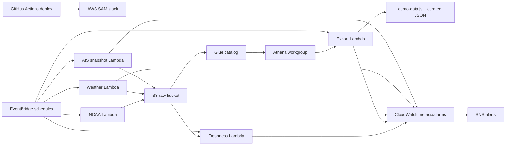

# System Architecture Overview

This is the primary architecture page for the current live system.

The active deployment is a **3-port serverless pilot** built around:

- AWS SAM
- EventBridge schedules
- Lambda functions
- one versioned S3 bucket
- Glue + Athena
- CloudWatch + SNS
- a static dashboard export artifact

## Runtime Flow

## Current Scope

The deployed pilot is intentionally narrow:

- ports:
  - Rotterdam
  - Singapore
  - Los Angeles
- AIS capture is windowed, not continuous
- the dashboard is powered by an export artifact, not by a live API

## What This Architecture Is Good At

- low monthly cost
- simple browser-first deployment
- real cloud runtime for demos and interviews
- clear operator visibility
- stable raw data capture for later ML work

## What It Is Not Yet

- a full production ML platform
- a global continuous visibility control tower
- a production serving API
- a feature-store-backed online model serving system

## Main Components

### Ingestion layer

- AIS snapshot Lambda
- weather Lambda
- NOAA Lambda

### Storage and query layer

- versioned S3 bucket
- Glue database `dpl_pilot`
- Athena workgroup `dpl-serverless-pilot-pilot`

### Serving layer

- export Lambda
- `exports/dashboard/demo-data.js`

### Monitoring layer

- CloudWatch dashboard
- CloudWatch alarms
- SNS alerts

## Related Pages

- [Serverless Operations Runbook](03-ec2-ingestion-runbook.md)
- [Serverless Ingestion Implementation Explained](04-ec2-ingestion-implementation-explained.md)
- [Data Flow And Storage Contract](15-data-flow-and-storage-contract.md)
- [Monitoring And Alarm Semantics](17-monitoring-and-alarm-semantics.md)
- [IAM And Deployment Identity](18-iam-and-deployment-identity.md)
- [Athena Query Layer Guide](19-athena-query-layer-guide.md)
- [Serverless Pilot](12-serverless-pilot.md)
- [Serverless Status And Cost Forecast](13-serverless-status-and-costs.md)
