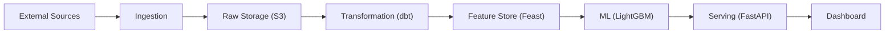

# Pipeline Architecture Explorer

An interactive, zoomable visualization of the complete Data Party Logistics ML pipeline — from external data sources through ingestion, transformation, feature engineering, model training, and serving.

## [→ Open Interactive Pipeline Explorer](architecture/pipeline-explorer.html){ .md-button .md-button--primary }

## How to Use

| Action | What it does |
|---|---|
| **Scroll** | Zoom in/out |
| **Drag background** | Pan the view |
| **Drag a node** | Reposition it |
| **Hover a node** | See description, source file path, and implementation status |
| **Click a node** | Opens the source file on GitHub |
| **Click a layer button** (top bar) | Show/hide that pipeline layer |

## Architecture Layers

## Maintaining the Explorer

The explorer reads from a single JSON file: `docs/architecture/pipeline-data.json`.

To add a new component:

1. Add a node entry to the `nodes` array with `id`, `label`, `layer`, `status`, `description`, `source`, and `github` fields.
2. Add edge entries to the `edges` array connecting it to upstream/downstream nodes.
3. Commit and push — GitHub Pages will deploy it automatically.
